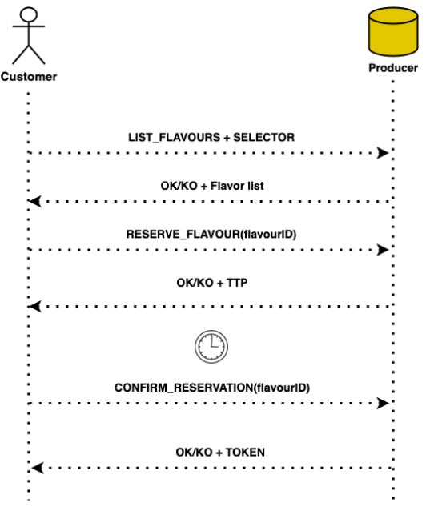

============
The **REsource Advertisement and Reservation (REAR) protocol** aims at providing secure data exchange of resources and capabilities between different cloud providers. It can be used to advertise resources (e.g., virtual machines and their characteristics in terms of CPU, RAM), capabilities (e.g., Kubernetes clusters) and (in future) services (e.g., a database as a server) to any third party, enabling potential customers to know what is available in other clusters, and possibly (automatically) establish the technical steps that enables the customer to connect and consume the resources/services agreed in the negotiation phase.

There are two main types of entity involved, which are **providers** and **customers**:
  * **Providers** avertise their resources and services in a standardized format.
  * **Customers**  explore and find resources according to their specific criteria.

Overall, REAR seamlessly integrates with established resource management systems and platforms.
This protocol accommodates diverse **resource types** and allows for **future expansions**.

## REAR Main Workflow

The protocol is characterized by the following main steps

1. Customer asks for the list of flavour (optional: selector for a certain amount of CPU, RAM, etc.).

2. Producer returns flavours that fit the request

3. Customer chooses to buy the flavour characterized by its Flavour ID

4. Producer returns the response indicating the flavor's availability, the Customer is granted a limited time to complete the purchase. This hold time is defined by the **Time To Purchase (TTP)**

5. Customer complete the purchase for the Flavour.

6. Producer returns the response: if the purchase is completed, issue purchase verification. 

### Other details

* If the customer does not make a purchase within the specified time frame, the Flavour will become available again for other customers.
* If another customer attempts to select a previously chosen Flavour, it will be blocked.
* After the purchase, the contract containing the customer's name and the corresponding Flavour ID will be securely stored in a remote database.

## Flavour Key elements

The Flavour list will be made with different flavours, each one with the following information:

1. **Flavour ID**: Each offer must have a unique Flavour ID instead of just the name.
2. **Provider ID**: Associate the Flavour with the corresponding Provider ID.
3. **Type**: Specify the type of the Flavour (e.g., VM/K8s Cluster/etc.).
4. **Characteristics**: Specify the capacities and resources provided by the Flavour (CPU, RAM, etc.). 
5. **Policy**:  Indicate whether the Flavour is aggregatable or partitionable.
6. **Owner**: This represents the entity that owns the Flavour, identified by its FQDN (Fully Qualified Domain Name) or marked as unknown. It can correspond to the Flavour's Provider ID."
7. **Price or Fee**: If applicable, indicate the associated price or fee for the Flavour.
8. **Expirtation Time**: t denotes the duration after which the Flavour requires refreshing. If the Flavour is not refreshed within this time, it becomes invalid or expires. The Expiration Time is calculated by adding a specific timestamp to the current time, indicating the remaining hours or days until expiration
9. **Optional Fields**: Other details such as limitations, promotions, availability etc., can be included as optional information.

## Policies
If the requested flavour is a resource, it may be characterized by one of the following flags:

* **Partitionable**: the Flavour can be divided into smaller units, but with a specified minimum CPU and RAM requirement. If the field is false, partitioning is not possible. A step value is defined to determine the valid increments for CPU and RAM. For instance, if the step value for CPU is 1, users can request quantities like 2, 3, or 4, but not decimal values such as 1.4 or 2.6. This step value ensures consistency within the Flavour's specifications.

* **Aggregatable**: allowing multiple instances of the same Flavour to be aggregated or combined. This feature facilitates resource pooling to meet higher demands or optimize resource utilization. The 'mincount' field indicates the minimum number of Flavours that must be aggregated when 'aggregatable' is set to true. If the field is set to false, the client can choose a single instance, such as a single VM, instead of a set of VMs.

## Optional Updating Messages

Customers can choose to receive availability updates for their preferred flavour types from a specific provider. This functionality is represented in the diagram as the **SUBSCRIBE_FLAVOUR_TYPE** request, and it can be implemented using technologies that support asynchronous request/response messages, such as WebSockets.
There are two types of messages which can be used to send updates regarding a specific flavour type:

* **Withdraw Message**: The provider sends this message to the consumer to notify them that a specific flavor type is no longer available. This serves as a notification to inform the consumer that the requested flavor type is no longer accessible.

* **Refresh Message**: The provider sends a refresh message to update a particular flavor type. This refresh helps maintain flavor type availability and enables the consumer to efficiently manage and allocate resources based on the updated expiration time.

